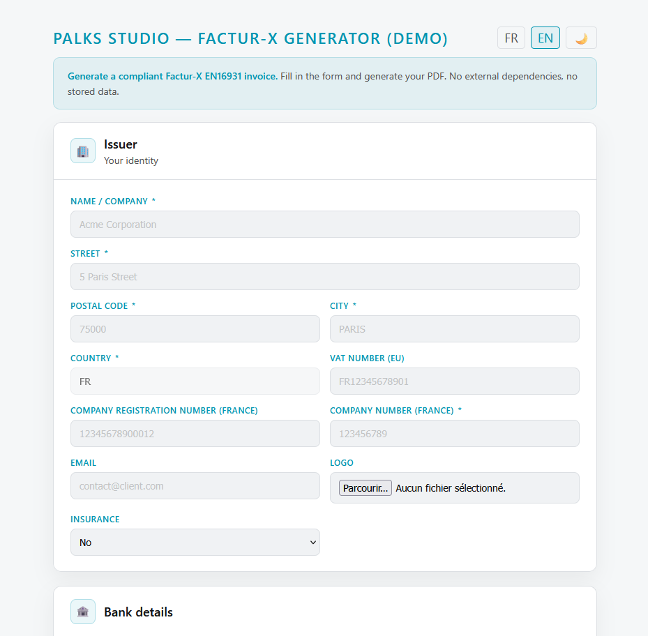

<p align="center">
  
</p>

> 🇬🇧 English | [🇫🇷 Français](./README_FR.md)


[](https://www.youtube.com/@Palks_Studio)
[](https://www.linkedin.com/in/palks-studio/)
[](https://palks-studio.com/en/facturation-facturx)

<p align="center">
  <a href="https://palks-studio.com">
    
  </a>
</p>

# Electronic Invoicing — Factur-X EN16931

> This repository is a technical presentation and demonstration of the system.  
> It does not contain downloadable source code or production files.

This project presents a real-world implementation of an electronic invoicing system  
capable of generating **Factur-X compliant invoices (EN16931 — Comfort profile)**.

The goal is not to showcase a library or a simple export,  
but to present a **complete, consistent and controlled system**  
for electronic invoice generation.

---

## Overview

The system enables:  

- generation of **hybrid PDF invoices (Factur-X)**  
- integration of a **structured XML compliant with EN16931**  
- full data consistency (lines, VAT, totals)  
- production of a single document, both human-readable and machine-readable

Each generated invoice is:  

- readable by humans (PDF)  
- processable by systems (embedded XML)  
- compliant with European interoperability requirements

[](https://palks-studio.com/en/facturx-invoice-generation)

---

## Tax compliance — VAT legal mentions

The system automatically determines and applies the correct VAT legal mention based on the client's zone:

| Situation                                    | Generated mention                                                            |
|----------------------------------------------|------------------------------------------------------------------------------|
| Issuer not subject to VAT (micro-enterprise) | TVA non applicable, art. 293B du CGI                                         |
| EU client with intra-community VAT number    | Reverse charge — VAT due by the recipient, art. 283-2 of the French Tax Code |
| Non-EU client                                | VAT exemption — art. 262 I of the French General Tax Code                    |

The mention is embedded in both the visible PDF and the structured XML.  
It is not entered manually — it is determined by the system based on the client's data.

---

## Approach

This project follows a deliberately different approach compared to common solutions:  

- **no SaaS dependency**  
- **no critical third-party services**  
- **no isolated file export logic**

Factur-X compliance is treated as:  

> **a system-level property**, not as a standalone file output.

This ensures:  

- global data consistency  
- reproducible invoice generation  
- clean integration into real business workflows

---

## Demonstration

The demonstration highlights:  

- the final rendered Factur-X invoice  
- the hybrid structure (PDF + embedded XML)  
- usage within a real invoicing context

Simplified flow:  

```text
Input data → Controlled processing → Factur-X compliant PDF
```


---

## Positioning

This system is designed for:  

- freelancers and independent professionals  
- small and medium-sized businesses (SMEs)  
- internal invoicing systems  
- environments requiring EN16931 compliance

It fits into a broader approach of:  

- **autonomous invoicing systems**  
- **controlled infrastructure**  
- **no reliance on external platforms**

---

## What this repository shows

- a coherent electronic invoicing architecture  
- a system-level approach to Factur-X compliance  
- a real-world example of hybrid invoice generation

---

## What this repository does not show

For security and intellectual property reasons:  

- no XML generation logic  
- no validation pipelines (XSD / Schematron)  
- no internal processing scripts  
- no production architecture details

The purpose is to demonstrate capabilities,  
not to expose implementation.

---

## Compliance

Generated invoices comply with:  

- **EN16931 standard (Comfort profile)**  
- **Factur-X format (PDF with embedded XML)**  
- **PDF/A-3 archival requirements**

---

## Philosophy

This project reflects an engineering approach focused on:  

- simplicity  
- determinism  
- auditability  
- long-term reliability

The objective is not to multiply tools,  
but to build a system that is clear, stable and fully controlled.

---

## Need a compliance solution?

In the context of the ongoing electronic invoicing rollout in France,  
this kind of system can provide a solid foundation for a controlled and progressive compliance approach.

If you need a solution adapted to your business, a Factur-X EN16931 integration,  
or an autonomous invoicing system without SaaS dependencies, Palks Studio can help.

[](https://palks-studio.com/en/contact)

---

© Palks Studio — see LICENSE.md  
- https://palks-studio.com
