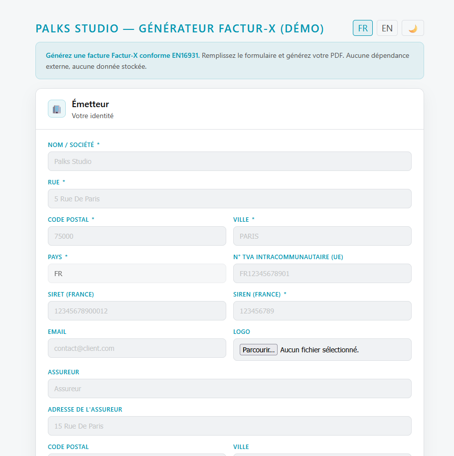

<p align="center">
  
</p>

> 🇫🇷 Français | [🇬🇧 English](./README.md)


[](https://www.youtube.com/@Palks_Studio)
[](https://www.linkedin.com/in/palks-studio/)
[](https://palks-studio.com/fr/facturation-facturx)

<p align="center">
  <a href="https://palks-studio.com">
    
  </a>
</p>

# Facturation électronique — Factur-X EN16931

> Ce dépôt constitue une présentation technique et une démonstration du système.  
> Il ne contient pas de code source téléchargeable ni de fichiers de production.

Ce projet présente une implémentation réelle d’un système de facturation électronique  
capable de produire des factures **Factur-X conformes EN16931 (profil Comfort)**.

L’objectif n’est pas de démontrer une bibliothèque ou un export isolé,  
mais de présenter un **système complet, cohérent et maîtrisé**  
de génération de factures électroniques.

---

## Vue d’ensemble

Le système permet :  

- la génération de factures **PDF hybrides (Factur-X)**  
- l’intégration d’un **XML structuré conforme EN16931**  
- la cohérence complète des données (lignes, TVA, totaux)  
- la production d’un document unique lisible et exploitable automatiquement

Chaque facture produite est :  

- lisible par un humain (PDF)  
- exploitable par un système (XML embarqué)  
- conforme aux exigences d’interopérabilité européennes

[Accéder à la ressource](https://palks-studio.com/fr/facturation-facturx)

---

## Conformité fiscale — mentions légales TVA

Le système détermine et applique automatiquement la mention légale TVA selon la zone du client :

| Situation                                          | Mention générée                                             |
|----------------------------------------------------|-------------------------------------------------------------|
| Émetteur non assujetti à la TVA (micro-entreprise) | TVA non applicable, art. 293B du CGI                        |
| Client UE avec numéro de TVA intracommunautaire    | Autoliquidation — TVA due par le preneur, art. 283-2 du CGI |
| Client hors UE                                     | Exonération de TVA — art. 262 I du CGI                      |

La mention est intégrée à la fois dans le PDF visible et dans le XML structuré embarqué.  
Elle n'est pas saisie manuellement — elle est déterminée par le système selon les données du client.

---

## Approche

Ce projet repose sur une approche volontairement différente des solutions classiques :  

- **pas de SaaS**  
- **pas de dépendance externe critique**  
- **pas d’export isolé**

La conformité Factur-X est traitée comme :  

> **une propriété du système**, et non comme un simple fichier généré.

Cela garantit :  

- une cohérence globale des données  
- une reproductibilité des factures  
- une intégration propre dans des processus métiers réels

---

## Démonstration

La démonstration met en avant :  

- le rendu final d’une facture Factur-X  
- la structure hybride (PDF + XML embarqué)  
- l’utilisation dans un contexte réel de facturation

Flux simplifié :  

```text
Données de facturation → Traitement contrôlé → PDF Factur-X conforme
```


---

## Positionnement

Ce système est conçu pour :  

- freelances et indépendants  
- PME / TPE  
- systèmes internes de facturation  
- environnements nécessitant une conformité EN16931

Il s’intègre dans une logique de :  

- **facturation autonome**  
- **infrastructure maîtrisée**  
- **absence de dépendance à des plateformes externes**

---

## Ce que ce dépôt montre

- une architecture de facturation électronique cohérente  
- une approche système de la conformité Factur-X  
- un exemple concret de production de factures hybrides

---

## Ce que ce dépôt ne montre pas

Pour des raisons de sécurité et de propriété :  

- aucune logique de génération XML  
- aucun pipeline de validation (XSD / Schematron)  
- aucun script interne  
- aucune architecture de production détaillée

L’objectif est de présenter les capacités du système,  
sans exposer son implémentation.

---

## Conformité

Les factures produites respectent :  

- la norme **EN16931 (profil Comfort)**  
- le format **Factur-X (PDF + XML embarqué)**  
- les contraintes d’archivage **PDF/A-3**

---

## Philosophie

Ce projet illustre une approche :  

- simple  
- déterministe  
- auditable  
- durable

L’objectif n’est pas de multiplier les outils,  
mais de construire un système fiable, compréhensible et maîtrisé.

---

## Besoin de mise en conformité ?

Dans le contexte actuel de la généralisation de la facturation électronique en France,  
ce système illustre une approche structurée, autonome et maîtrisée de la facturation électronique.

Pour une mise en conformité, une intégration Factur-X EN16931  
ou la mise en place d’un système de facturation adapté à votre activité,  
Palks Studio propose des solutions sur mesure.

[](https://palks-studio.com/fr/contact)

---

© Palks Studio — voir LICENSE.md  
- https://palks-studio.com
